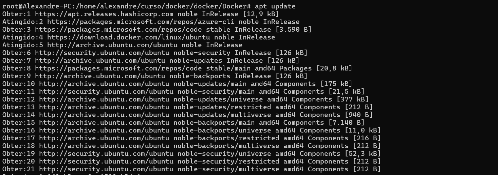
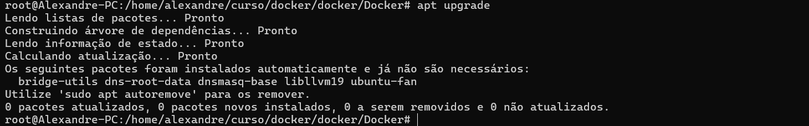

# 01 - Instalando o Docker

=======

### Atualizando a distribuição
<ul>
	<li>apt update</li>
	<li>sudo apt-get install ca-certificates curl</li>
	<li></li>
	<li> apt upgrade</li>
	<li></li>
</ul>

### Agora damos as devidas permissões 
<ul>
	<li>sudo install -m 0755 -d /etc/apt/keyrings</li>
	<li>sudo curl -fsSL https://download.docker.com/linux/ubuntu/gpg -o /etc/apt/keyrings/docker.asc</li>
	<li>sudo chmod a+r /etc/apt/keyrings/docker.asc</li>
	<li>echo \
  "deb [arch=$(dpkg --print-architecture) signed-by=/etc/apt/keyrings/docker.asc] https://download.docker.com/linux/ubuntu \
  $(. /etc/os-release && echo "${UBUNTU_CODENAME:-$VERSION_CODENAME}") stable" | \
  sudo tee /etc/apt/sources.list.d/docker.list > /dev/null
sudo apt-get update</li>
	<li></li>
</ul>
