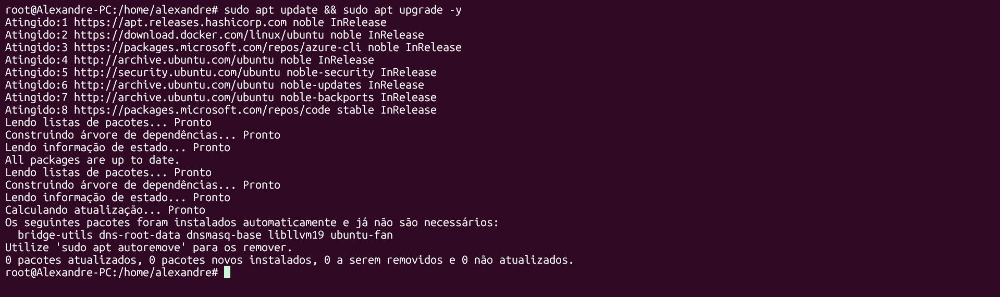
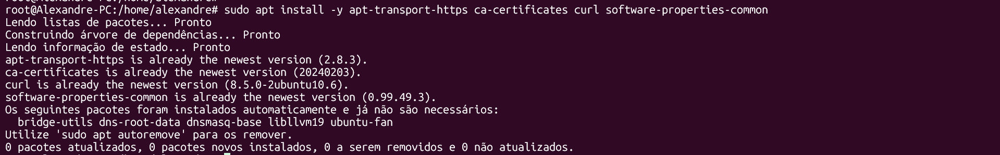
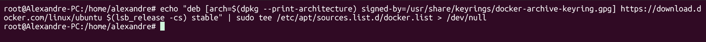
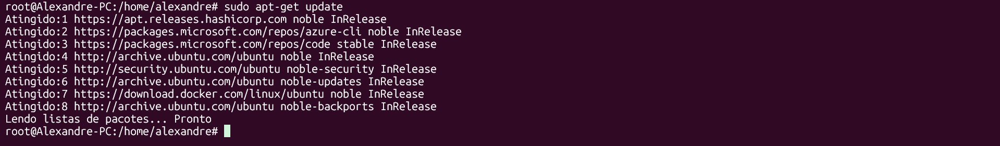
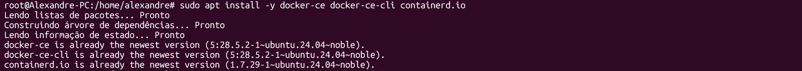
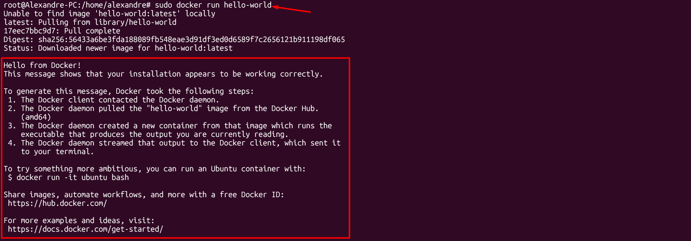

# 🐳01 - Instalando o Docker

---

### Atualizando a distribuição
<ul>
	<li>sudo apt update && sudo apt upgrade -y</li>
	<li>  </li>
</ul>

### Instalando os pacotes necessários para o Docker
<ul>
	<li>sudo apt install -y apt-transport-https ca-certificates curl software-properties-common</li>
	<li>  </li>
</ul>

### Adicionando chave GPG Oficial do Docker 
<ul>
	<li>curl -fsSL https://download.docker.com/linux/ubuntu/gpg | sudo gpg --dearmor -o /usr/share/keyrings/docker-archive-keyring.gpg</li>
	<li>  </li>
</ul>

### Adicionando repositório do Docker 
<ul>
	<li>echo "deb [arch=$(dpkg --print-architecture) signed-by=/usr/share/keyrings/docker-archive-keyring.gpg] https://download.docker.com/linux/ubuntu $(lsb_release -cs) stable" | sudo tee /etc/apt/sources.list.d/docker.list > /dev/null </li>
	<li>  </li>
</ul>

### Atualize a lista de pacotes
<ul>
	<li> sudo apt-get update </li>
	<li>  </li>
</ul>

### Instale o Docker 
<ul>
	<li> sudo apt install -y docker-ce docker-ce-cli containerd.io </li>
	<li>  </li>
</ul>

### Verifique a versão do docker instalada 
<ul>
	<li> docker --version </li>
	<li>  </li>
</ul>

### Teste o docker iniciando um contaiener hello world
<ul>
	<li> sudo docker run hello-world </li>
</ul>

#### Se tudo ocorrer bem, você ira visualizar o retorno abaixo:

