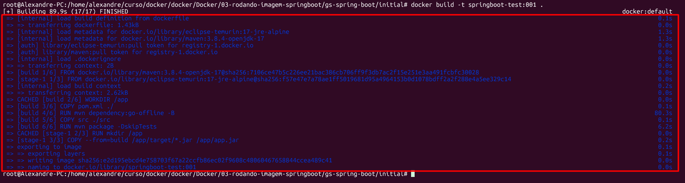
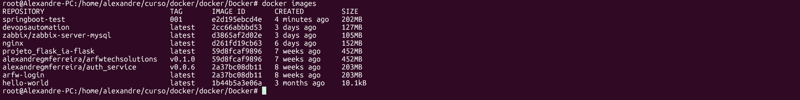
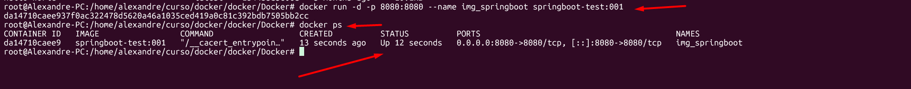
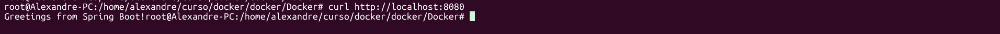
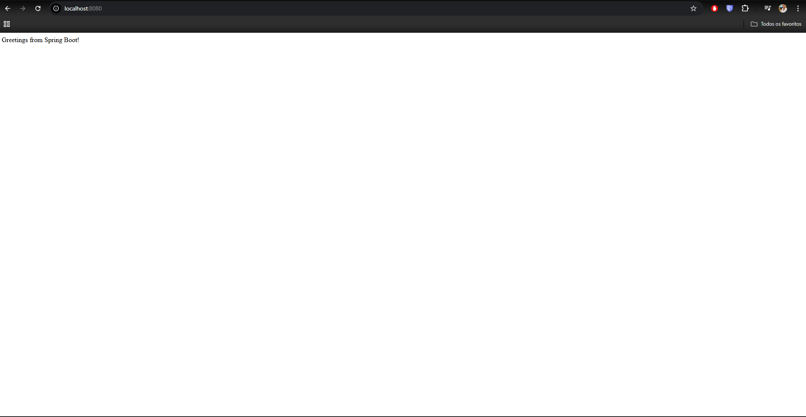

# 🐳03 - Rodando uma imagem multi-stage spring boot

### O que é Spring Boot?
#### Spring Boot é um framework Java de código aberto que simplifica e acelera o desenvolvimento de aplicações web e microsserviços baseadas no Spring Framework.
#### Fonte: https://spring.io/guides/gs/spring-boot#initial

### O que é imagem multi-stage build no Docker?
#### Multi-stage build no Docker é uma funcionalidade que utiliza múltiplas instruções FROM no mesmo Dockerfile para criar imagens de contêiner menores e mais eficientes.

#### 01- Primeiros vamos realizar o git clone do repositório https://github.com/spring-guides/gs-spring-boot#

<ul>
        <li> git clone git@github.com:spring-guides/gs-spring-boot.git </li>
	<li> com isso teremos os arquivos necessários para iniciar o processo e fazer o build </>
</ul>

#### 02- Uma vez que já estamos com todos os arquivos necessários vamos realizar a criação de um arquivo dockerfile. Eu utilizo o editor de texto nano.  

<ul>
	<li>nano -l dockerfile</li>
	<li>inserimos as informações abaixo:</li>
	<li>
	
		#Usando imagem oficial do Mavem - Tem tudo o que precisa para o Maven baixar as dependencias e compilar o código
		FROM maven:3.8.4-openjdk-17 AS build

		#Define o diretório de trabalho dentro do container - Todos os comando seguintes serão rodados dentro de /app
		WORKDIR /app

		#Copia o pom.xml e baxa as dependencias para o projeto
		COPY pom.xml ./
		RUN mvn dependency:go-offline -B

		#Copia o código fonte e empacota o projeto, pulando os teste, gera o arquovo .jar que será usado na proxima etapa
		COPY src ./src
		RUN mvn package -DskipTests

		#Etapa 2 - Imagem final para a execução

		#Imagem baseada em Alpine linux com o JRE instalado, reduz drasticamente o tamanho da imagem final
		FROM eclipse-temurin:17-jre-alpine

		#Informa ao Docker que o container irá escutar na porta 8080
		EXPOSE 8080

		#Cria um diretório /app dentro do container - Serve como local organizado para armazenar o JAR da aplicação
		RUN mkdir /app

		#Copia o Jar gerado na etapa de build "Passo 1 " para o diretorio /app da imagem final
		COPY --from=build /app/target/*.jar /app/app.jar

		#Define o comando que será executado quando o container iniciar
		CMD ["java", "-jar", "/app/app.jar"] </li>
	

</ul>

#### 03- Agora vamos rodar o comando docker build para criar a imagem 
<ul>	
        <li> docker build -t <nome-da-imagem:versao> .</li>
	<li> docker build -t springboot-test:001 . </li>
	<li> este comando fará com que a imagem seja construida seguindo os parametros que inserimos acima... de cima para baixo.
        <li>  </li>
</ul>

#### 04- Uma vez que a imagem foi construida, podemos agora utilizar o comando docker images para visualizar as imagens que temos localmente.
<ul>
        <li> docker images </li>
        <li> 
</ul>

#### 05- Agora vamos rodar o container com a imagem que criamos.
<ul>	
	<li> O comando -d serve para rodar o container em segundo plano. </li> 
	<li> O comando -p serve para expor a porta "colcoar a mesma porta que utilizamos no dockerfile". </li>
	<li> O comando --name serve para dar um nome ao container. </li>
	<li> O comando springboot-test:0.0.1 é a imagem que criamos e queremos rodar em container. </li>
	<li> docker run -d -p 8080:8080 --name img_springboot springboot-test:001 </li>
	<li> Após executamos este comando iremos receber um hash informando que o container foi iniciado, mas para ter certeza rodamos também o docker ps </li>
	<li>  </li>
</ul>

#### 06- Agora vamos testar o container 
<ul>
	<li> Podemos rodar o comando curl http://localhost:8080 para visualizar de dentro do container </li>
	<li>  </li>
	<li> Podemos também realizar o teste atraves do navegador utilizando o mesmo endereço localhost http://localhost:8080 no qual receberemos o retorno abaixo >/li>
	<li>  </li>
</ul>

#### 07- Dessa forma o exercicio estará finalizado.
